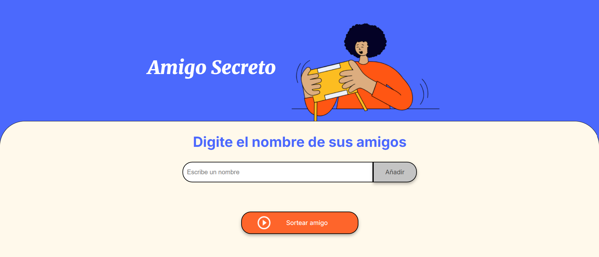

# 🎉 Amigo Secreto - Sorteo de Nombres




## 📖 Índice
1. [Descripción del Proyecto](#-descripción-del-proyecto)
2. [Estado del Proyecto](#-estado-del-proyecto)
3. [Demostración de Funciones y Aplicaciones](#-demostración-de-funciones-y-aplicaciones)
4. [Acceso al Proyecto](#-acceso-al-proyecto)
5. [Tecnologías Utilizadas](#-tecnologías-utilizadas)
6. [Licencia](#-licencia)

---

## 📋 Descripción del Proyecto
Este es un proyecto desarrollado en **JavaScript**, **HTML** y **CSS** que permite a los usuarios ingresar nombres de amigos en una lista y luego realizar un **sorteo aleatorio** para determinar quién será el "amigo secreto".

## 📌 Estado del Proyecto
✅ Completado ✅

## 🎮 Demostración de Funciones y Aplicaciones

1. Escribe el nombre de un amigo en el campo de texto.
2. Presiona el botón **"Añadir"** para agregarlo a la lista.
3. Una vez que todos los nombres estén en la lista, haz clic en **"Sortear Amigo"**.
4. Se mostrará el nombre del amigo secreto en pantalla.

---

## 🌎 Acceso al Proyecto

1. **Clona este repositorio en tu computadora:**
   ```bash
   git clone https://github.com/MakaryV/ONE-challenge-1.git
   ```

2. **Accede a la carpeta del proyecto:**
   ```bash
   cd ONE-challenge-1
   ```

3. **Abre el archivo `index.html` en tu navegador.**

📌 **Publicar en GitHub Pages**:
1. **Sube tu código** a un repositorio en GitHub.
2. **Ve a la configuración** del repositorio (**Settings**).
3. Busca la sección **GitHub Pages**.
4. En **Source**, selecciona la rama `main` y la carpeta `/root`.
5. **Guarda los cambios** y espera unos minutos.
6. **Copia el enlace generado** y compártelo con quien quieras.

📌 **Más información**: [GitHub Pages - Documentación](https://pages.github.com/)

---

## 🔧 Tecnologías Utilizadas
- HTML5
- CSS3
- JavaScript

---

## 📝 Licencia

Este proyecto está bajo la licencia **MIT**. Puedes usarlo y modificarlo libremente.

---

🚀 **Desarrollado con 💙 por [MakaryV]** 🚀

